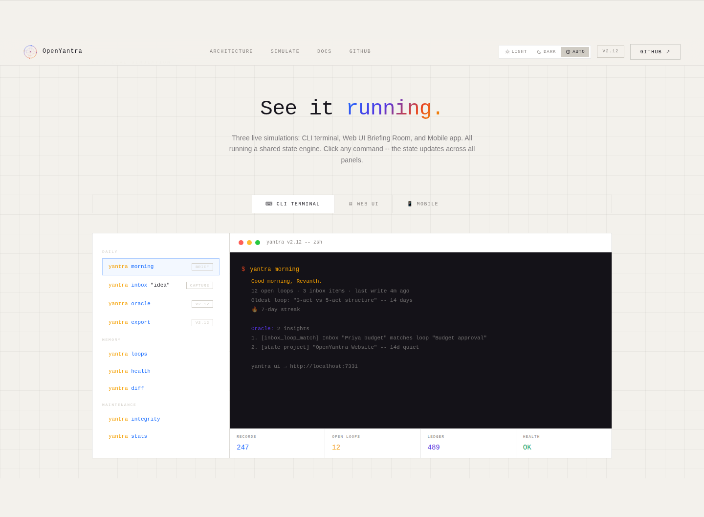
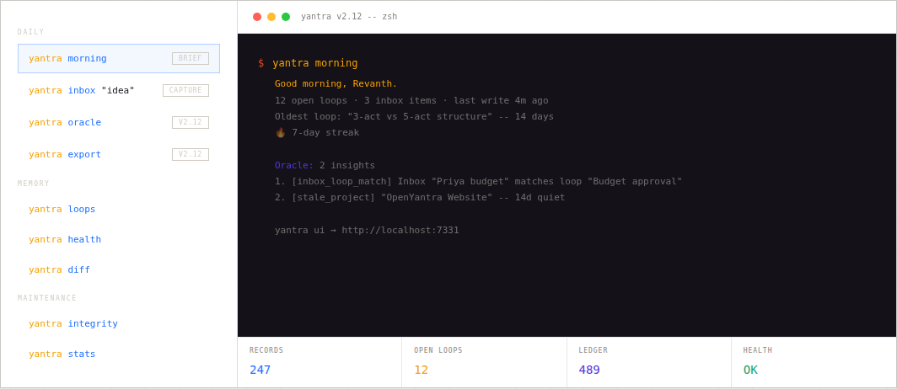
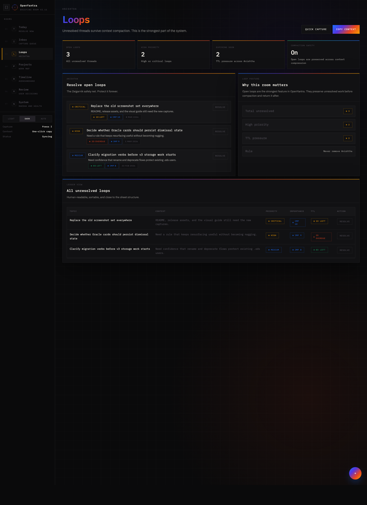
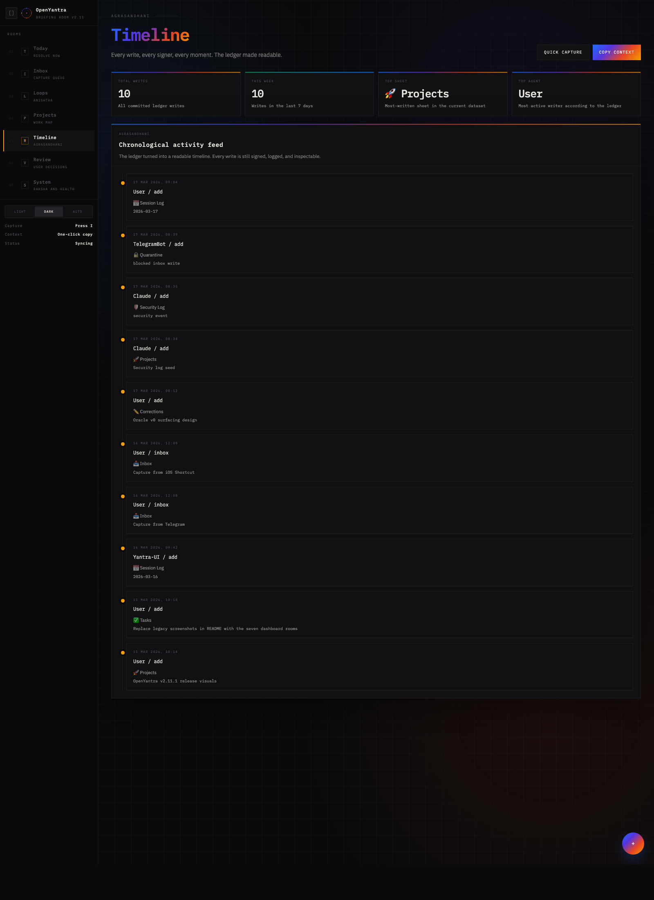
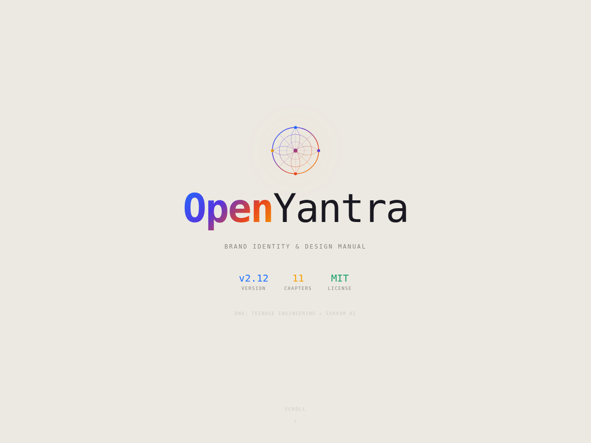
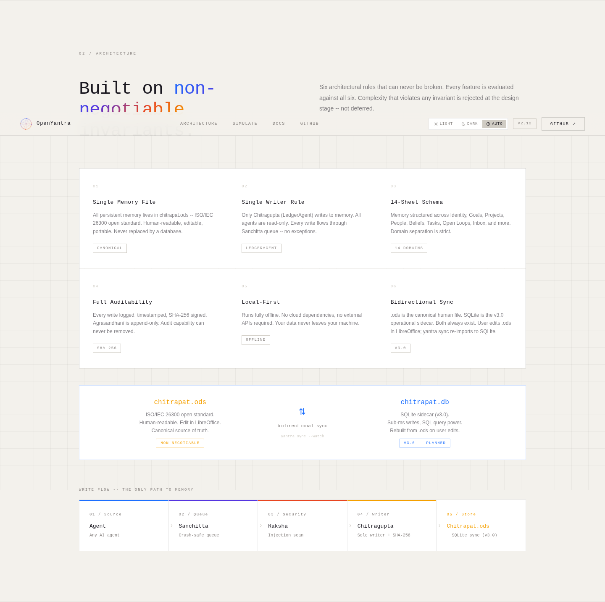
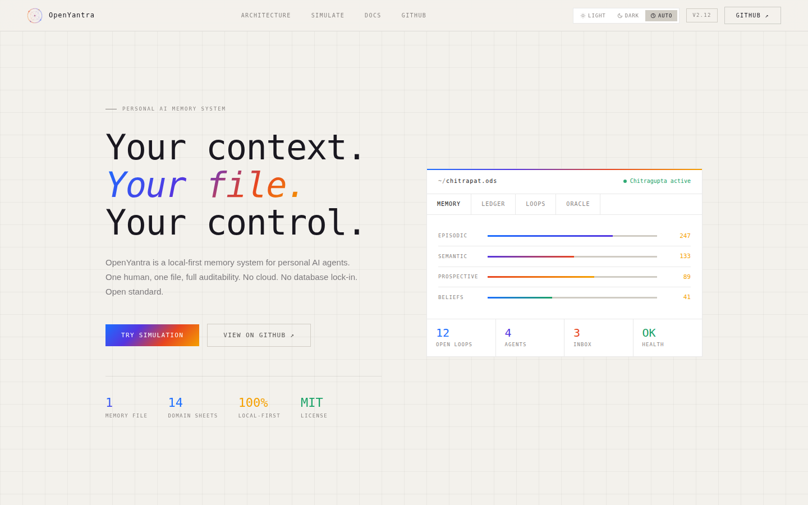
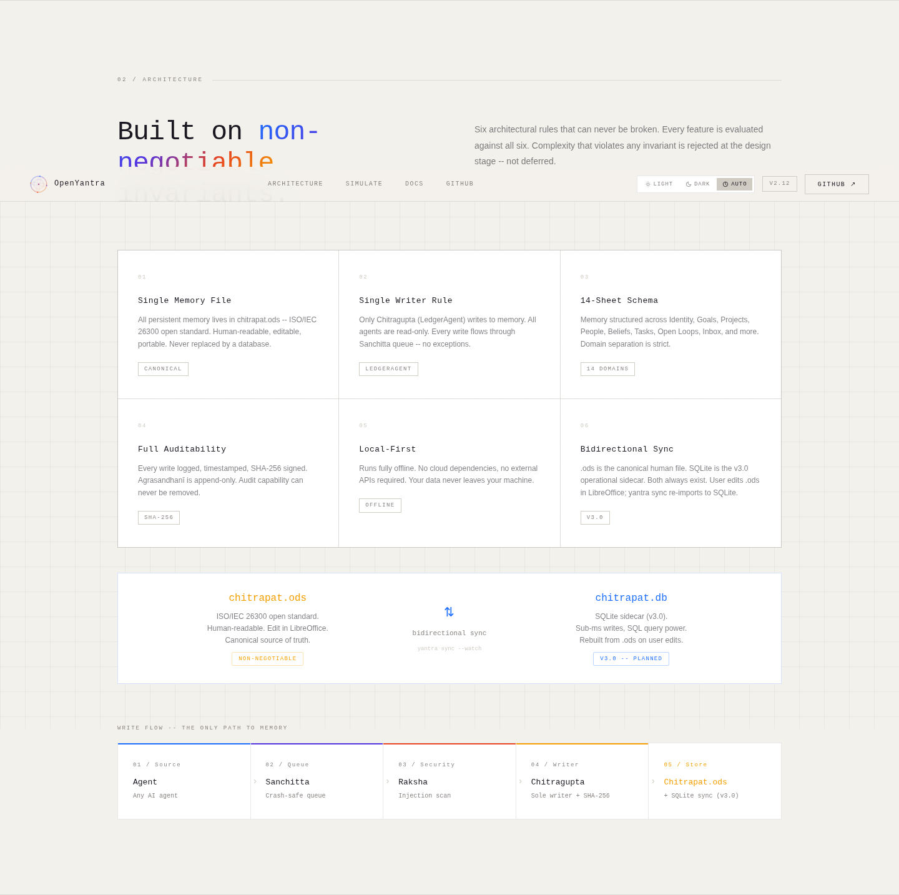

<p align="center">
  
</p>

<h1 align="center">OpenYantra</h1>
<h3 align="center">The Sacred Memory Machine</h3>
<h4 align="center"><em>यन्त्र -- Inspired by Chitragupta, the Hindu God of Data</em></h4>

<p align="center">
  
  
  
  
  
  
  
</p>

<p align="center">
  <strong>Your personal AI agents remember nothing between sessions. OpenYantra fixes that.</strong><br/>
  One open-standard file. One trusted writer. Any agent. Any framework. Zero cloud.
</p>

---

<p align="center">
  
</p>

---

## The Problem -- Why Your AI Forgets

Every time you open a new chat with Claude, ChatGPT, or any AI agent it starts completely blank. It does not know your current projects, your decisions from last week, or what you left unfinished. You repeat yourself every session.

When the conversation gets too long, the AI compresses older messages -- your active work context disappears mid-task.

**OpenYantra solves this permanently:**

| Without OpenYantra | With OpenYantra |
|---|---|
| AI starts blank every session | AI knows your projects, goals, preferences |
| Repeat context every time | Context injected automatically at session start |
| Unfinished work lost in compaction | Open Loops flushed before compaction, restored after |
| No record of what agents changed | Every write SHA-256 signed, permanent audit trail |
| Agents can overwrite each other | Single trusted writer -- no conflicts |
| Memory lives in a cloud you do not control | Memory lives in a file on your computer |

---

## What is OpenYantra?

OpenYantra is a **personal AI memory system** -- a structured file your AI agents read from and write to, so your context persists across sessions, agents, and time.

It is:
- **Local-first** -- your memory file lives on your machine, never in a cloud
- **Human-readable** -- open it in LibreOffice, read it, edit it like a spreadsheet
- **Agent-agnostic** -- works with Claude, ChatGPT, OpenClaw, LangChain, AutoGen
- **Auditable** -- every write signed with SHA-256, permanent audit trail
- **Protected** -- Raksha security engine blocks prompt injection attempts

Named after **Chitragupta** (चित्रगुप्त) -- the Hindu God of Data, divine scribe who keeps the complete record of every soul's deeds. The architecture mirrors the mythology precisely: one trusted recorder, one immutable ledger, and a rule that the user's word (Dharma-Adesh) always overrides everything else.

> *"Your purpose is to stay in the minds of all people and record their thoughts and deeds."*
> -- Brahma to Chitragupta

---

## Install in One Command

**Mac / Linux** -- fully self-contained. Installs Python, LibreOffice, all dependencies, creates a virtual environment, sets up the CLI, adds a desktop shortcut:

```bash
curl -sSL https://raw.githubusercontent.com/revanthlevaka/OpenYantra/main/install.sh | bash
```

**Windows (PowerShell):**
```powershell
irm https://raw.githubusercontent.com/revanthlevaka/OpenYantra/main/install.ps1 | iex
```

After install:
```bash
yantra bootstrap    # 12-question interview -- sets up your memory
yantra ui           # opens http://localhost:7331
yantra morning      # your daily brief
yantra oracle       # cross-reference insights (v2.12)
yantra export       # export memory to markdown/JSON (v2.12)
```

No API keys required. No cloud account. No configuration files.

---

## How It Works

`yantra bootstrap` asks you 12 questions -- your name, your projects, your goals, the people you work with, what your AI should never suggest. The answers populate your **Chitrapat** -- a `.ods` spreadsheet you can open in LibreOffice at any time.

When you start an AI session, OpenYantra injects a context block into the system prompt:

```
[OPENYANTRA CONTEXT -- v2.12]
User: Revanth Levaka | Filmmaker | Hyderabad, IN
Active Projects: Feature Screenplay → Write act 2 (High)
Open Loops: [High] 3-act vs 5-act -- undecided | [Medium] Follow up with Priya
Goals: Complete debut feature film
Preferences: Communication: direct | Tools: terminal, LibreOffice
```

Your AI agent now knows who you are and what is unresolved -- without you saying a word.

---

## The 14-Sheet Memory File

<p align="center">
  
  <em>The Today tab -- daily command centre with Daily Insight card and one-click actions.</em>
</p>

| Sheet | Sanskrit | What it stores |
|---|---|---|
| 👤 Identity | Svarupa | Name, occupation, location, communication style |
| 🎯 Goals | Sankalpa | Long and short-term aims with success metrics |
| 🚀 Projects | Karma | Active work -- domain, status, next concrete step |
| 👥 People | Sambandha | Relationships, context, open threads with each person |
| 💡 Preferences | Ruchi | Tools, habits, communication style, anti-goals |
| 🧠 Beliefs | Vishwas | Values, worldview, belief evolution history |
| ✅ Tasks | Kartavya | Action items with project link and priority |
| 🔓 Open Loops ★ | Anishtha | Unresolved threads -- compaction safety net |
| 📅 Session Log | Dinacharya | Per-session summaries |
| ⚙️ Agent Config | Niyama | Per-agent instructions |
| 📒 Agrasandhanī | -- | Immutable audit trail -- every write SHA-256 signed |
| 📥 Inbox | Avagraha | Quick capture -- categorise later |
| ✏️ Corrections | Sanshodhan | Agent-proposed edits pending your approval |
| 🔒 Quarantine | Nirodh | Blocked injection attempts |

**★ Open Loops (Anishtha)** -- unanimously named by all 8 models across 4 stress-test rounds as the strongest and most novel feature. Implements the Zeigarnik Effect as a persistent data structure.

---

## Morning Briefing

<p align="center">
  
  <em>The morning brief in your terminal -- surfaces what matters before you open any other app.</em>
</p>

Runs automatically on your first `yantra` command each day:

```bash
yantra morning
```

```
========================================================
  Good morning, Revanth Levaka. OpenYantra Morning Brief
  2026-03-16
========================================================

  🔓  Open Loops (3 total):
     [High    ] Decide screenplay structure  (2d left)
     [Medium  ] Follow up with Priya on budget

  🚀  Stale Projects:
     Feature Screenplay -- no update in 9 days → Write act 2

  📥  Inbox: 2 items unrouted

  💡  Suggestion:
     'budget revision' in Inbox may relate to:
     'Follow up with Priya on budget'

  🕰️   Past memory:
     "Creative freedom over short-term money"

  🔥  Streak: 3 days
  ────────────────────────────────────────────────────
  yantra ui → http://localhost:7331
========================================================
```

Also appears as the **Daily Insight card** at the top of the browser dashboard.

---

## Browser Dashboard

```bash
yantra ui   # → http://localhost:7331
```

<p align="center">
  
  <em>Open Loops tab -- all unresolved Anishtha with priority and TTL countdown.</em>
</p>

<p align="center">
  
  <em>Timeline tab -- every write Chitragupta has ever made, chronologically.</em>
</p>

| Tab | Purpose |
|---|---|
| 🌅 Today | Daily command centre -- Daily Insight card, urgent items, one-click actions |
| 📥 Inbox | Unrouted captures. Press `i` anywhere to capture instantly. |
| 🚀 Projects | Active work with status, priority, next step |
| 🔓 Open Loops | All unresolved threads sorted by importance |
| ✅ Tasks | Pending action items |
| 📅 Timeline | Chronological activity feed |
| ⚡ Conflicts | Visual diff -- agent proposed vs your value. Your choice wins. |
| ✏️ Corrections | Agent-proposed edits pending approval |
| 🔒 Security | Quarantine review and threat log |
| 📒 Ledger | Full SHA-256 signed audit trail |
| 💚 Health | System status and row counts |
| 📊 Stats | Memory growth analytics |

---

## Security -- Raksha Engine

<p align="center">
  
  <em>Security tab -- quarantine review, threat log, agent trust tiers.</em>
</p>

Every write scanned before Chitragupta commits it. Only confirmed threats are blocked (permissive mode).

**Protects against:** prompt injection · jailbreak attempts (DAN, STAN) · agent impersonation · Unicode/RTL attacks · schema corruption

| Tier | Who | Treatment |
|---|---|---|
| 5 -- User | You | Never blocked -- Dharma-Adesh |
| 4 -- Chitragupta | System | Full trust |
| 3 -- Known | Claude, OpenClaw, LangChain, AutoGen | Standard scan |
| 2 -- Unknown | Unregistered agents | Stricter scan |
| 1 -- External | Telegram bot, iOS Shortcut, email | Suspicious treated as confirmed |
| 0 -- Untrusted | Flagged agents | Any flag → block |

---

## Bootstrap Interview

<p align="center">
  
  <em>The 12-question bootstrap interview -- populates all key sheets via conversation.</em>
</p>

```bash
yantra bootstrap
```

| # | Question | Sheet populated |
|---|---|---|
| 1 | What does your AI always forget? | Sets focus |
| 2 | Name, occupation, location | Identity |
| 3 | Life domains (3–5 areas) | Beliefs |
| 4 | Active projects + next concrete step | Projects |
| 5 | Goals + how you will measure success | Goals |
| 6 | Important people + one open thread with each | People + Open Loops |
| 7 | Preferences, tools, working hours | Preferences |
| 8 | Anti-goals -- what AI should never suggest | Beliefs |
| 9 | Decision principles + belief you no longer hold | Beliefs |
| 10 | Decision you are second-guessing + recurring problem | Open Loops |
| 11 | Reminder preference | Agent Config |
| 12 | Live preview of all populated sheets | -- |

---

## Memory Analytics

<p align="center">
  
  <em>Stats tab -- memory growth, writes by sheet and agent, loop resolution rate.</em>
</p>

```bash
yantra stats
```

Total rows · total writes · writes last 7 / 30 days · open loops · loop resolution rate · high-importance items · writes by agent · writes by sheet.

---

## Copy Context -- Paste into Any AI Chat

```bash
yantra context
```

Formats your memory as a clean Markdown block and copies to clipboard. Paste into Claude.ai, ChatGPT, or any web-based AI. Bridges your local memory to the AI tools you already use.

---

## Mobile Capture

**Telegram bot** (recommended):
```bash
export TELEGRAM_BOT_TOKEN="your_token_from_BotFather"
yantra telegram
# Any message → Inbox. /loop /task /goal /digest /health
```

**iOS Shortcut:**
```bash
yantra shortcut
# Prints your Mac's local IP + exact Shortcut setup instructions
```

**Email:**
```bash
yantra mail
# Local SMTP on port 2525 -- forward any email → Inbox
```

---

## Quick Start (Python)

```python
from openyantra import OpenYantra

oy = OpenYantra("~/openyantra/chitrapat.ods", agent_name="Claude")

# Inject into system prompt at session start
system_prompt = oy.build_system_prompt_block()

# Write via Chitragupta
oy.add_project("My Film", domain="Creative", status="Active",
               priority="High", next_step="Write act 2", importance=9)
oy.flush_open_loop("Structure decision", "3-act vs 5-act undecided",
                   priority="High", ttl_days=30)

# Quick capture to Inbox
oy.inbox("Priya mentioned budget revision needed by Friday")

# Semantic search -- importance-weighted results
results = oy.search("screenplay structure")

# Copy context for web AI tools
md = oy.build_context_markdown()

# Session end
oy.log_session(topics=["screenplay"], decisions=["Research 5-act"])
```

---

## All CLI Commands

```bash
# Setup
yantra bootstrap    # 12-question interview
yantra doctor       # system check: Python, packages, port, ODS integrity

# Daily use
yantra morning      # daily brief -- runs automatically on first command of day
yantra ui [port]    # browser dashboard → http://localhost:7331
yantra context      # copy full context to clipboard -- paste into any AI chat
yantra inbox "text" # quick capture to Inbox
yantra digest       # daily summary: loops + stale projects + insights
yantra stats        # memory growth analytics

# Memory management
yantra health       # stats overview
yantra route        # auto-route all unprocessed Inbox items
yantra loops        # list all unresolved Open Loops
yantra diff         # belief contradiction check
yantra ttl          # check expired Open Loops

# Mobile
yantra telegram     # Telegram bot → Inbox
yantra shortcut     # iOS Shortcut server (port 7332)
yantra mail         # Email-to-Inbox SMTP (port 2525)
yantra schedule     # schedule daily digest via launchd / cron

# Maintenance
yantra integrity    # verify all Agrasandhani SHA-256 signatures
yantra archive      # rotate old session logs to archive file
yantra migrate      # upgrade older Chitrapat to current schema
yantra security     # full Chitrapat security audit
yantra open         # open Chitrapat in LibreOffice
yantra version      # show version
```

---

## OpenClaw Integration

```toml
[hooks]
session_start = "openyantra.openclaw.hooks:session_start_hook"
pre_compact   = "openyantra.openclaw.hooks:pre_compact_hook"
post_compact  = "openyantra.openclaw.hooks:post_compact_hook"
session_end   = "openyantra.openclaw.hooks:session_end_hook"

[env]
OPENYANTRA_FILE = "~/openyantra/chitrapat.ods"
```

Full guides for OpenClaw · LangChain · AutoGen · Raw Anthropic API → [docs/DEPLOYMENT.md](docs/DEPLOYMENT.md)

---

## How It Compares

| Feature | Flat Text | Vector/RAG | MemGPT | Mem0 | Zep | OpenAI Memory | **OpenYantra** |
|---|:---:|:---:|:---:|:---:|:---:|:---:|:---:|
| Human-readable | ✅ | ❌ | ❌ | ❌ | ❌ | ❌ | ✅ |
| User can edit | ✅ | ❌ | ❌ | ❌ | ❌ | ❌ | ✅ |
| Semantic search | ❌ | ✅ | ⚠️ | ✅ | ✅ | ⚠️ | ✅ |
| Compaction-safe | ❌ | ❌ | ✅ | ⚠️ | ✅ | ✅ | ✅ |
| Multi-agent safe | ❌ | ⚠️ | ❌ | ⚠️ | ✅ | ✅ | ✅ |
| Immutable audit trail | ❌ | ❌ | ❌ | ❌ | ⚠️ | ❌ | ✅ |
| Injection protection | ❌ | ❌ | ❌ | ❌ | ❌ | ❌ | ✅ |
| Open format (ISO) | ✅ | ❌ | ❌ | ❌ | ❌ | ❌ | ✅ |
| Zero infrastructure | ✅ | ❌ | ❌ | ⚠️ | ❌ | ✅ | ✅ |
| Browser dashboard | ❌ | ❌ | ❌ | ⚠️ | ✅ | ✅ | ✅ |
| CLI installer | ❌ | ❌ | ❌ | ❌ | ❌ | ❌ | ✅ |
| Mobile capture | ❌ | ❌ | ❌ | ❌ | ❌ | ❌ | ✅ |
| Daily briefing | ❌ | ❌ | ❌ | ❌ | ❌ | ❌ | ✅ |
| Copy context for web AI | ❌ | ❌ | ❌ | ❌ | ❌ | ❌ | ✅ |
| Schema migration | ❌ | ❌ | ❌ | ❌ | ❌ | ❌ | ✅ |
| Open protocol (CC0) | ❌ | ❌ | ❌ | ❌ | ❌ | ❌ | ✅ |

---

## Version History

| Version | Key additions |
|---|---|
| v1.0 | Core protocol -- Chitragupta, Agrasandhanī, Anishtha, Sanchitta, 12-sheet schema |
| v2.0 | VidyaKosha semantic index, BM25 + TF-IDF hybrid, Pratibimba snapshots |
| v2.1 | Inbox, Importance column, TTL loops, admission rules, belief diffing, browser dashboard, installer |
| v2.2 | Complete repo -- all docs, openclaw/, examples/, references/, DEPLOYMENT.md |
| v2.3 | Self-contained installer (auto Python + LibreOffice + all deps), Telegram bot, daily digest |
| v2.4 | Raksha security -- injection scanner, agent trust tiers 0–5, Mudra verification, quarantine |
| v2.5 | Today tab, Timeline, Conflict Resolver, floating capture button, mobile CSS, docs/docs/visual-guide.html |
| v2.6 | 12-question Bootstrap interview, first-launch onboarding tour, brand assets rebuilt |
| v2.7 | Importance-weighted retrieval (relevance × importance × recency), `yantra stats` |
| v2.12 | iOS Shortcut server, email-to-inbox SMTP, `yantra migrate`, `yantra schedule` |
| v2.9 | Agrasandhanī integrity check, session log archival, partial ODS reads, Stats tab, 7 UI screenshots |
| v2.9.1 | Copy Context -- `yantra context`, paste full memory into any AI chat |
| v2.12 | Morning Briefing -- `yantra morning`, Daily Insight card, streak counter, proactive suggestions |
| v3.0 *(planned)* | SQLite backend, `.ods` as canonical export, bidirectional sync, kernel/plugin architecture |

---

## Global Stress-Test -- 8 AI Models, 3 Continents, 4 Rounds

The architecture was independently reviewed four times -- pre-v1.0, post-v2.0, post-v2.2, and post-v2.9. No model was aware of another's response.

**The only unanimous verdict across all 4 rounds and all 8 models:**
The Chitragupta single-writer pattern must never change.

**Named unanimously in all 4 rounds:**
Anishtha (Open Loops) is the strongest and most novel feature.

See [WHITEPAPER.md](WHITEPAPER.md) for the complete four-round synthesis.

---

## Inspired by Chitragupta

| Sanskrit | Mythology | OpenYantra |
|---|---|---|
| Chitragupta | Sole trusted recorder | LedgerAgent -- only writer |
| Agrasandhanī | Cosmic register | `📒` audit trail |
| Chitrapat | Life scroll | `chitrapat.ods` |
| Anishtha | Unfinished intent (Zeigarnik) | Open Loops -- compaction safety |
| Mudra | Divine seal | SHA-256 signature |
| Dharma-Adesh | Righteous command | User edits always win |
| Raksha | Divine protection | Security engine |
| VidyaKosha | Knowledge repository | Semantic search index |

See [MYTHOLOGY.md](MYTHOLOGY.md) · [WHITEPAPER.md](WHITEPAPER.md) · [docs/docs/visual-guide.html](docs/docs/visual-guide.html)

---

## Regional Compliance

| Profile | Region | Laws |
|---|---|---|
| OpenYantra-IN 🇮🇳 | India (home) | DPDP Act 2023, IT Act 2000 |
| OpenYantra-EU 🇪🇺 | Europe | GDPR, EU AI Act, Data Act 2023 |
| OpenYantra-US 🇺🇸 | United States | CCPA/CPRA, HIPAA, COPPA |
| OpenYantra-CN 🇨🇳 | China | PIPL, DSL, Cybersecurity Law |

See [PRIVACY.md](PRIVACY.md) for full regional specifications.

---

## File Structure

```
openyantra/
├── openyantra.py             ← Core library v2.12
├── vidyakosha.py             ← Semantic search (VidyaKosha)
├── yantra_ui.py              ← Browser dashboard (12 tabs)
├── yantra_security.py        ← Raksha security engine
├── yantra_digest.py          ← Daily proactive digest
├── telegram_bot.py           ← Telegram → Inbox
├── ios_shortcut.py           ← iOS Shortcut → Inbox (HTTP server)
├── yantra_mail.py            ← Email → Inbox (local SMTP)
├── yantra_migrate.py         ← Schema migration tool
├── install.sh                ← Mac/Linux self-contained installer
├── install.ps1               ← Windows self-contained installer
├── chitrapat_template.ods    ← Blank memory file (open in LibreOffice)
├── docs/docs/visual-guide.html         ← Interactive architecture diagram
├── WHITEPAPER.md             ← Research document
├── PROTOCOL.md               ← Open spec (CC0)
├── SKILL.md                  ← AI skill definition
├── MYTHOLOGY.md              ← Chitragupta origin + Sanskrit naming
├── PRIVACY.md                ← Regional profiles (IN · EU · US · CN)
├── screenshots/              ← 7 UI screenshots
├── docs/DEPLOYMENT.md        ← Framework integration guide
├── openclaw/                 ← OpenClaw plugin + hooks
├── examples/                 ← Quickstart + LangChain adapter
├── references/               ← Controlled vocabulary
└── assets/                   ← Brand assets
```

---

## Contributing

Framework adapters · Mobile capture improvements · Benchmarks (LOCOMO / DMR) · Language ports · v3.0 SQLite backend

Open an issue before a PR for protocol-level changes.

---

## License

Protocol Specification: **CC0 1.0 Universal** (Public Domain)
Library: **MIT License**

---

*Built in Hyderabad, India. Conceived by Revanth Levaka -- filmmaker and open-source builder.*
*Stress-tested by 8 AI models across 3 continents across 4 rounds.*
*Named in honour of Chitragupta -- the Hindu God of Data.*

*The record exists to serve the remembered, not the recorder.*

## Screenshots

| Today Tab | CLI Terminal | Web UI |
|---|---|---|
|  |  |  |

| Mobile | Architecture | Brand Manual |
|---|---|---|
|  |  |  |

