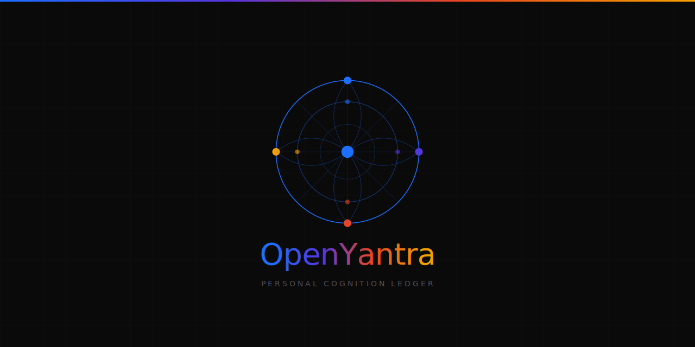
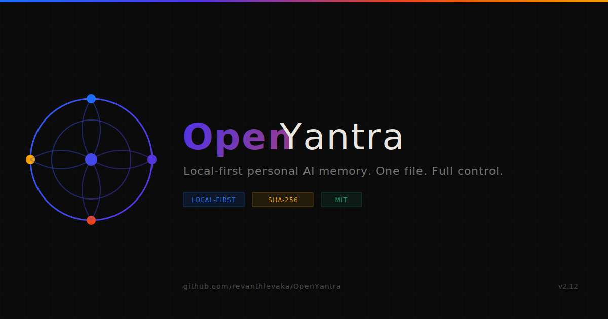

<p align="center">
  
</p>

<h1 align="center">OpenYantra</h1>
<h3 align="center">Personal memory for one human and their personal AI agents</h3>
<h4 align="center"><em>यन्त्र — inspired by Chitragupta, the Hindu God of Data</em></h4>

<p align="center">
  
  
  
  
  
  
</p>

<p align="center">
  <strong>One human. One memory file. One trusted writer.</strong><br/>
  Local-first, human-readable, audit-safe memory for Claude, OpenAI tools, OpenClaw, LangChain, and custom agents.
</p>

---

## What OpenYantra Is

OpenYantra is a persistent memory standard for a single person and their personal AI agents. It is not enterprise software, not multi-tenant infrastructure, and not a cloud memory service.

The system is built around one canonical file, `chitrapat.ods`, and one trusted writer, **Chitragupta (LedgerAgent)**. Everything else reads, retrieves, routes, summarizes, or proposes. Nothing else writes directly.

## v2.11 Highlights

- Rebuilt the dashboard in the new **v3 Briefing Room** design language.
- Consolidated the product into three mental models: **Capture. Review. Resolve.**
- Shipped a 7-tab dashboard: **Today, Inbox, Loops, Projects, Timeline, Review, System**.
- Added the stable `oracle-card` hook for proactive resurfacing in the Today view.
- Moved the dashboard server to serve the canonical file at `UI/v3/dashboard.html`.
- Cleaned the release surface back to the supported capture channels: **Telegram bot** and **iOS Shortcut**.

## Non-Negotiable Architecture

- **Chitragupta** is the only writer. The single-writer pattern does not change.
- **Chitrapat (`.ods`)** remains human-readable and first-class.
- **VidyaKosha** keeps hybrid retrieval and per-agent snapshot behavior.
- **Anishtha (Open Loops)** remains the compaction safety net and proactive memory spine.
- **Raksha** stays active on every write path.
- **Sanchitta** remains the crash-safe write queue and replay layer.

## Install

Mac / Linux:

```bash
curl -sSL https://raw.githubusercontent.com/revanthlevaka/OpenYantra/main/install.sh | bash
```

Windows PowerShell:

```powershell
irm https://raw.githubusercontent.com/revanthlevaka/OpenYantra/main/install.ps1 | iex
```

First-run flow:

```bash
yantra bootstrap
yantra ui
```

Optional capture surfaces:

```bash
yantra telegram
yantra shortcut
```

OpenYantra intentionally does **not** include email or SMTP capture.

## The v3 Briefing Room

The v3 UI is the daily interface over the `.ods` ledger. It is designed to feel like a calm, information-dense operations desk rather than a generic SaaS admin panel.

- **Capture**: quick intake through Inbox, Telegram, and iOS Shortcut
- **Review**: scan loops, routing decisions, chronology, and safety signals
- **Resolve**: close loops, complete tasks, route captures, approve edits

### Dashboard Tabs

| Tab | Answers |
|---|---|
| **Today** | What needs attention right now? |
| **Inbox** | What has been captured but not routed yet? |
| **Loops** | What unresolved threads are aging or becoming risky? |
| **Projects** | What active work needs motion next? |
| **Timeline** | What changed, and when did it change? |
| **Review** | What needs approval, correction, or conflict resolution? |
| **System** | Is the ledger healthy, secure, and internally consistent? |

The Today tab also contains the **Daily Insight** panel with the stable `oracle-card` DOM hook for Oracle work in v2.12.

## Morning Briefing And Copy Context

Shipped in v2.10 and carried forward in the v2.11 rebuild:

```bash
yantra morning
yantra context
```

- `yantra morning` gives you a daily brief before you open the dashboard.
- `yantra context` exports a paste-ready memory block for Claude, ChatGPT, or any AI chat.

## The 14-Sheet Memory File

| Sheet | Sanskrit | Purpose |
|---|---|---|
| Identity | Svarupa | Who you are, where you are, how you work |
| Goals | Sankalpa | Long-range and near-term aims |
| Projects | Karma | Active work and next concrete steps |
| People | Sambandha | Important relationships and interaction context |
| Preferences | Ruchi | Tools, habits, working preferences, anti-goals |
| Beliefs | Vishwas | Values, principles, and worldview shifts |
| Tasks | Kartavya | Action items linked to projects and priorities |
| Open Loops | Anishtha | Unresolved threads and compaction-safe intent |
| Session Log | Dinacharya | Session summaries, decisions, and topics |
| Agent Config | Niyama | Per-agent instructions and operating rules |
| Ledger | Agrasandhani | Immutable SHA-256-signed write trail |
| Inbox | Avagraha | Raw capture before routing |
| Security Log | Raksha | Warnings, detections, and trust events |
| Quarantine | Nirodh | Blocked prompt injection and suspicious writes |

## Capture Channels

### Telegram bot

```bash
export TELEGRAM_BOT_TOKEN="your_token"
yantra telegram
```

Use Telegram for low-friction daily capture from anywhere.

### iOS Shortcut

```bash
yantra shortcut
```

This starts the local HTTP endpoint for one-tap inbox capture from iPhone.

## v2.11.1 Dashboard Screenshots

Captured from `http://localhost:8000` against the rebuilt v3 Briefing Room dashboard.

| Today | Inbox |
|---|---|
|  |  |

| Loops | Projects |
|---|---|
|  |  |

| Timeline | Review |
|---|---|
|  |  |

### System


## Release Assets




Refreshed for v0.2.0:

- `assets/logo_horizontal.svg`
- `assets/banner_github.svg`
- `assets/og_card.svg`
- `assets/icon_512.svg`
- `assets/icon_192.svg`

## Common Commands

```bash
yantra bootstrap          # interview-based setup
yantra ui                 # browser dashboard at http://localhost:7331
yantra morning            # morning brief
yantra context            # copy markdown context for an AI chat
yantra inbox "text"       # quick capture
yantra route              # route pending inbox items
yantra loops              # inspect open loops
yantra health             # check ledger and sheet counts
yantra telegram           # Telegram capture surface
yantra shortcut           # iOS Shortcut capture surface
```

## Docs

- [Brand Manual](docs/BRAND_MANUAL.md)
- [Visual Guide](docs/VISUAL_GUIDE.md)
- [Deployment Guide](docs/DEPLOYMENT.md)
- [Protocol](PROTOCOL.md)
- [Mythology](MYTHOLOGY.md)
- [Whitepaper](WHITEPAPER.md)

## Release History

| Version | Key additions |
|---|---|
| **v2.8** | iOS Shortcut inbox capture, schema migration groundwork, email/SMTP permanently removed |
| **v2.9** | Session log archival, integrity checker, Stats tab |
| **v2.10** | Morning Briefing, one-click Copy Context export |
| **v2.11** | v3 Briefing Room dashboard, 7-tab IA, `oracle-card` hook, FileResponse-based UI serving |
| **v2.11.1** | Captured all 7 dashboard rooms, refreshed logo/banner/OG/icon assets, updated README and Visual Guide imagery |
| **v3.0** *(planned)* | WAL-backed storage, SQLite adapter, `.ods` materialized export, incremental retrieval updates |

## Repository Layout

```text
OpenYantra/
├── openyantra.py
├── vidyakosha.py
├── yantra_ui.py
├── yantra_digest.py
├── telegram_bot.py
├── ios_shortcut.py
├── yantra_security.py
├── install.sh
├── install.ps1
├── UI/
│   └── v3/
│       ├── dashboard.html
│       └── index.html
├── docs/
│   ├── BRAND_MANUAL.md
│   ├── VISUAL_GUIDE.md
│   └── DEPLOYMENT.md
├── openyantra-brand-manual.html
├── visual-guide.html
├── PROTOCOL.md
├── MYTHOLOGY.md
└── WHITEPAPER.md
```

## License

Protocol specification: **CC0 1.0 Universal**  
Library: **MIT**

---

Built in Hyderabad, India.  
Named in honour of Chitragupta — the divine record-keeper.  
The record exists to serve the remembered, not the recorder.
