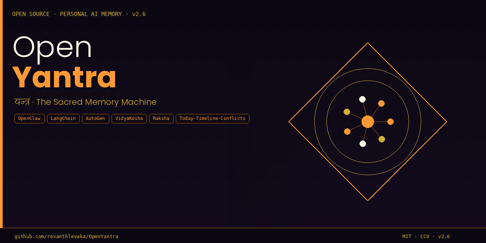

<p align="center">
  
</p>

<h1 align="center">OpenYantra</h1>
<h3 align="center">The Sacred Memory Machine</h3>
<h4 align="center"><em>यन्त्र — Inspired by Chitragupta, the Hindu God of Data</em></h4>

<p align="center">
  
  
  
  
  
  
</p>

<p align="center">
  <strong>A vendor-neutral, human-readable persistent memory standard for personal agentic AI.</strong><br/>
  Any agent. Any framework. Any model. Any platform.
</p>

---

<p align="center">
  
</p>

---

## Install in one command

**Mac / Linux:**
```bash
curl -sSL https://raw.githubusercontent.com/revanthlevaka/OpenYantra/main/install.sh | bash
```

**Windows (PowerShell):**
```powershell
irm https://raw.githubusercontent.com/revanthlevaka/OpenYantra/main/install.ps1 | iex
```

Then:
```bash
yantra bootstrap    # interview-based setup — populates memory via conversation
yantra ui           # open browser dashboard at http://localhost:7331
yantra inbox "text" # quick capture from anywhere
yantra health       # system status
```

---

## What is OpenYantra?

**Yantra** (यन्त्र) means two things in Sanskrit:
1. A **sacred geometric diagram** — precise, structured, purposeful
2. A **machine or instrument** — a tool that works on your behalf

OpenYantra is both. A structured memory instrument for AI agents, inspired by the world's oldest data architect — **Chitragupta**.

> *"Your purpose is to stay in the minds of all people and record their thoughts and deeds."*
> — Brahma to Chitragupta

---

## The Problem

Every AI agent session starts blank. You repeat yourself. Active work disappears when context gets compressed. Memory systems are opaque and cloud-dependent. In multi-agent environments, agents overwrite each other with no audit trail.

**OpenYantra solves all of this — with a single open-standard file and a single trusted writer.**

---

## Architecture

```
chitrapat.ods  (open free in LibreOffice on any platform)
├── 👤 Identity      (Svarupa)     — who you are
├── 🎯 Goals         (Sankalpa)    — what you want
├── 🚀 Projects      (Karma)       — active work + next steps
├── 👥 People        (Sambandha)   — your world
├── 💡 Preferences   (Ruchi)       — how you like things
├── 🧠 Beliefs       (Vishwas)     — what you think
├── ✅ Tasks         (Kartavya)    — action items
├── 🔓 Open Loops    (Anishtha)    — unresolved threads (compaction safety)
├── 📅 Session Log   (Dinacharya)  — per-session summaries
├── ⚙️ Agent Config  (Niyama)      — per-agent instructions
├── 📒 Agrasandhanī               — immutable audit trail
├── 📥 Inbox         (Avagraha)    — quick capture, route later (v2.1)
└── ✏️ Corrections   (Sanshodhan) — pending agent edits for approval (v2.1)
```

---

## The Chitragupta Pattern

Only **Chitragupta (LedgerAgent)** writes to the Chitrapat. All other agents read.

```
              chitrapat.ods
           ┌──────────────────┐
           │  READ — any agent│
           └────────┬─────────┘
                    │ WRITE (exclusive)
           ┌────────▼─────────┐
           │   Chitragupta    │  ← sole writer
           │  (LedgerAgent)   │  ← validates + admission rules
           │                  │  ← SHA-256 Mudra seal
           │                  │  ← Agrasandhanī audit
           └────────▲─────────┘
                    │ WriteRequest
       ┌────────────┼────────────┐
    Claude       AutoGen     OpenClaw
   (read-only)  (read-only) (read-only)
                    │
                  User ← Dharma-Adesh always wins
```

---

## Quickstart (Python)

```bash
pip install odfpy pandas scikit-learn faiss-cpu fastapi uvicorn
pip install sentence-transformers  # optional — better search quality
```

```python
from openyantra import OpenYantra

oy = OpenYantra("~/openyantra/chitrapat.ods", agent_name="Claude")
oy.bootstrap(user_name="Revanth", occupation="Filmmaker", location="Hyderabad, IN")

# Inject into system prompt
print(oy.build_system_prompt_block())

# Write via Chitragupta
oy.add_project("My Film", domain="Creative", status="Active",
               priority="High", next_step="Write act 2", importance=9)
oy.flush_open_loop("3-act vs 5-act", "Undecided on structure",
                   priority="High", ttl_days=30)

# Quick capture (v2.1)
oy.inbox("Priya mentioned budget needs revision by Friday")

# Semantic search (VidyaKosha)
results = oy.search("screenplay structure decisions")
for r in results:
    print(r["sheet"], r["primary_value"], f"score={r['score']:.3f}")

# Session end
oy.log_session(topics=["screenplay"], decisions=["Research 5-act structure"])
```

---

## Browser Dashboard

```bash
yantra ui
# Opens http://localhost:7331
```

- **Dashboard** — stats, open loops count, inbox pending, stale projects
- **Inbox** — quick capture with keyboard shortcut `i`
- **Projects** — active Karma with status tags
- **Open Loops** — all Anishtha with priority + TTL
- **Corrections** — approve/reject agent-proposed edits
- **Ledger** — full Agrasandhanī audit trail
- **Health** — system status, row counts, VidyaKosha status

---

## CLI Commands

```bash
yantra bootstrap    # interview-based cold start — no empty spreadsheets
yantra ui [port]    # browser dashboard (default: 7331)
yantra health       # system status and stats
yantra inbox "text" # quick capture to Inbox
yantra route        # route Inbox items to correct sheets
yantra loops        # list open loops (Anishtha)
yantra diff         # check for belief contradictions
yantra ttl          # check for expired open loops
yantra version      # show version
```

---

## v2.1 Additions

| Feature | What it does |
|---|---|
| `📥 Inbox` sheet | Catch-all quick capture — no forced categorisation |
| `Importance` (1–10) | Every sheet — weights retrieval and filtering |
| `TTL_Days` on Anishtha | Open loops auto-expire, surfaced for review |
| Admission rules | Chitragupta filters noise writes before commit |
| Belief diffing | Monthly contradiction detection on Beliefs sheet |
| `memory_correction` API | Agents propose edits, user approves in browser |
| Dead man's switch | Alert if Chitragupta silent > N minutes |
| Browser dashboard | `yantra ui` — FastAPI + plain HTML, localhost:7331 |
| CLI installer | `install.sh` (Mac/Linux) + `install.ps1` (Windows) |
| Bootstrap Interview | Conversation-driven cold start — no empty forms |

---

## OpenClaw Integration

```toml
# openclaw/config.toml
[hooks]
session_start = "openyantra.openclaw.hooks:session_start_hook"
pre_compact   = "openyantra.openclaw.hooks:pre_compact_hook"
post_compact  = "openyantra.openclaw.hooks:post_compact_hook"
session_end   = "openyantra.openclaw.hooks:session_end_hook"

[env]
OPENYANTRA_FILE = "~/openyantra/chitrapat.ods"
```

See [docs/DEPLOYMENT.md](docs/DEPLOYMENT.md) for OpenClaw, LangChain, AutoGen, and raw API guides.

---

## How It Compares

| | Flat Text | Vector/RAG | MemGPT | Mem0 | Zep | OpenAI Memory | **OpenYantra** |
|---|:---:|:---:|:---:|:---:|:---:|:---:|:---:|
| **Human-readable** | ✅ | ❌ | ❌ | ❌ | ❌ | ❌ | ✅ |
| **User can edit** | ✅ | ❌ | ❌ | ❌ | ❌ | ❌ | ✅ |
| **Semantic search** | ❌ | ✅ | ⚠️ | ✅ | ✅ | ⚠️ | ✅ |
| **Compaction-safe** | ❌ | ❌ | ✅ | ⚠️ | ✅ | ✅ | ✅ |
| **Multi-agent safe** | ❌ | ⚠️ | ❌ | ⚠️ | ✅ | ✅ | ✅ |
| **Audit trail** | ❌ | ❌ | ❌ | ❌ | ⚠️ | ❌ | ✅ |
| **Open format (ISO)** | ✅ | ❌ | ❌ | ❌ | ❌ | ❌ | ✅ |
| **Zero infrastructure** | ✅ | ❌ | ❌ | ⚠️ | ❌ | ✅ | ✅ |
| **Browser UI** | ❌ | ❌ | ❌ | ⚠️ | ✅ | ✅ | ✅ |
| **CLI installer** | ❌ | ❌ | ❌ | ❌ | ❌ | ❌ | ✅ |
| **Open protocol (CC0)** | ❌ | ❌ | ❌ | ❌ | ❌ | ❌ | ✅ |

---

## Global Stress-Test — 8 AI Models, 3 Continents

The architecture was independently reviewed twice — before v1.0 (abstract) and after v2.0 (live code). All 8 models across 3 continents independently validated Anishtha (Open Loops) as the strongest feature. See [WHITEPAPER.md](WHITEPAPER.md) for the full synthesis.

---

## Regional Compliance

| Profile | Region | Law |
|---|---|---|
| **OpenYantra-IN** 🇮🇳 | India (home) | DPDP Act 2023 |
| **OpenYantra-EU** 🇪🇺 | Europe | GDPR, EU AI Act |
| **OpenYantra-US** 🇺🇸 | United States | CCPA/CPRA, HIPAA |
| **OpenYantra-CN** 🇨🇳 | China | PIPL, DSL |

---

## Inspired by Chitragupta

| Mythology | OpenYantra |
|---|---|
| Chitragupta — sole trusted recorder | LedgerAgent — only writer |
| Agrasandhanī — cosmic register | `📒` audit trail sheet |
| Chitrapat — life scroll | `chitrapat.ods` |
| Karma-Lekha — deed for recording | `WriteRequest` |
| Anishtha — unfinished intent | Open Loops — compaction safety |
| VidyaKosha — knowledge repository | Sidecar semantic index |

See [MYTHOLOGY.md](MYTHOLOGY.md) for the complete origin story.  
See [WHITEPAPER.md](WHITEPAPER.md) for the research document.

---

## File Structure

```
openyantra/
├── openyantra.py             ← Core library v2.1
├── vidyakosha.py             ← Semantic search engine
├── yantra_ui.py              ← Browser dashboard (FastAPI)
├── install.sh                ← Mac/Linux installer
├── install.ps1               ← Windows installer
├── chitrapat_template.ods    ← Blank memory file
├── WHITEPAPER.md             ← Research document
├── PROTOCOL.md               ← Open spec v2.6 (CC0)
├── SKILL.md                  ← AI skill definition
├── MYTHOLOGY.md              ← Chitragupta origin
├── PRIVACY.md                ← IN · EU · US · CN profiles
├── docs/
│   └── DEPLOYMENT.md         ← Integration guide
├── openclaw/
│   ├── plugin.py
│   └── hooks.py
├── examples/
│   ├── bootstrap.py
│   └── langchain_adapter.py
├── references/
│   └── controlled-vocab.md
└── assets/
    ├── icon_512.png
    ├── logo_horizontal.png
    ├── banner_github.png
    └── og_card.png
```

---

## Contributing

- Framework adapters — AutoGen, CrewAI, Semantic Kernel
- Mobile capture — Telegram bot, iOS Shortcut
- TimeAgent — temporal range queries
- Benchmarks — LOCOMO / DMR evaluation suite
- Language ports — TypeScript, Rust, Go

---

## License

Protocol: **CC0 1.0 Universal** (Public Domain)  
Library: **MIT License**

---

*Built in Hyderabad, India. Conceived by Revanth — filmmaker and open-source builder.*  
*The record exists to serve the remembered, not the recorder.*
